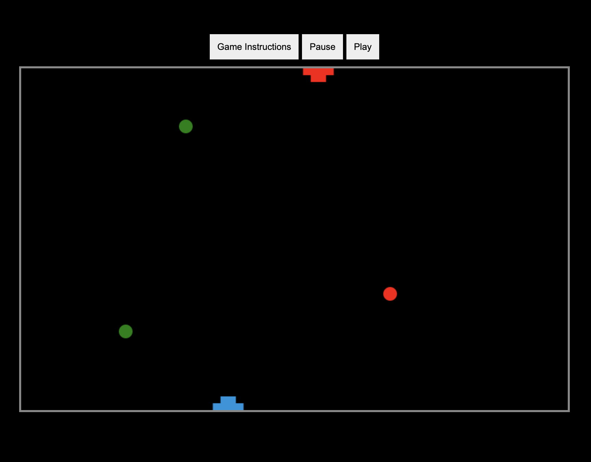
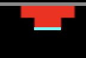

# Shooter

## Description 

A shooting game created with HTML, CSS, vanilla javascript and the canvas API.

Deployed link  https://dkbaffour777.github.io/shooter/

;

    
## Usage 
  - Instructions on how to play the game:
    - This is your player(human player), the highlighted part(red color) is the head of the player
    - ;
    - This is the AI player, the highlighted part(sky blue) is the head of the player
    - ;
    - Click play to start the game
    - Click pause to pause the game
    - Use your mouse/trackpad/left arrow/right arrow, to move your player to the left or right
    - Click anywhere with your mouse or trackpad to shoot
    - You only have 2 ammo material when you shoot so aim well
    - Your ammo will reset to 2 again when you catch the green ball with your head
    - You win when your bullet hits the head of the AI player
    - You loose when the bullet of the AI player hits your head

## Questions
  - 👋 Hi, I’m dkbaffour777
  - GitHub profile link: [github.com/dkbaffour777/](https://github.com/dkbaffour777/)
  - 📫 How to reach, email: dkbaffour777career@gmail.com
